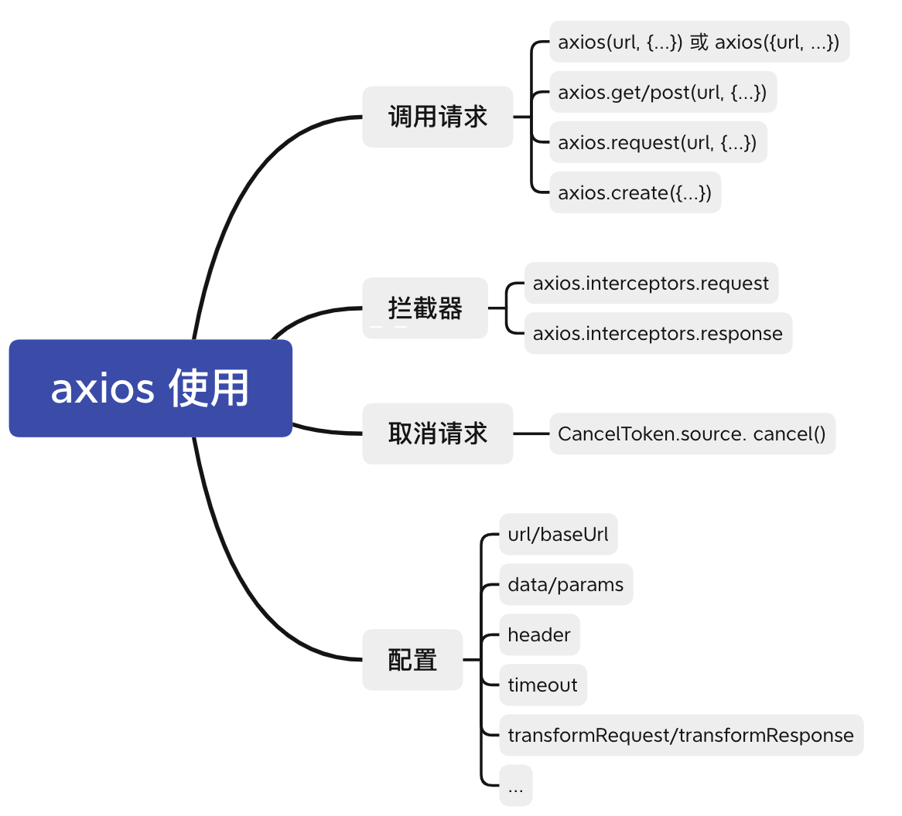
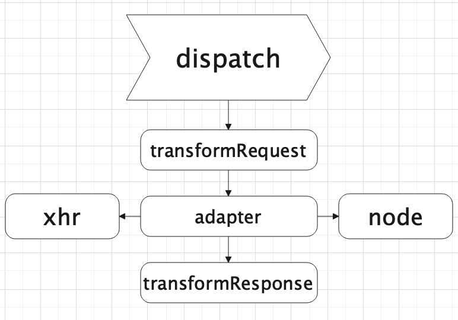

## 背景
日常开发中我们经常跟接口打交道，而在现代标准前端框架(Vue/React)开发中，离不开的是 axios，出于好奇阅读了一下源码。

阅读源码免不了枯燥无味，容易被上下文互相依赖的关系搞得一头露水，我们可以抓住主要矛盾，忽略次要矛盾，可结合 debugger 调试模式，先把主干流程梳理清楚，在慢慢啃细节比较好，以下是对源码和背后的设计思想进行解读，不足之处请多多指正。


## axios 是什么

1. 基于 promise 封装的 http 请求库（避免回调地狱）

2. 支持浏览器端和 node 端

3. 丰富的配置项：数据转换器，拦截器等等

4. 客户端支持防御 XSRF

5. 生态完善（支持 Vue/React，周边插件等等）

另外两条数据证明 axios 使用之广泛

1.截至 2021 年 6月底，github 的 star 数高达 85.4k


2.npm 的周下载量达到千万级别


## Axios 的基本使用




## 源码目录结构

先看看目录说明，如下


## 执行流程

先看看整体执行流程，有大体的概念，后面会细说
整体流程有以下几点：
1. `axios.create` 创建单独实例，或直接使用 `axios` 实例(`axios/axios.get...`)
2. `request` 方法是入口，`axios/axios.get` 等调用都会走进 `request` 进行处理
3. 请求拦截器
4. 请求数据转换器，对传入的参数 `data` 和 `header` 做数据处理，比如 `JSON.stringify(data)`
5. 适配器，判断是浏览器端还是 `node` 端，执行不同的方法
6. 响应数据转换器，对服务端的数据进行处理，比如 `JSON.parse(data)`
7. 响应拦截器，对服务端数据做处理，比如 `token` 失效退出登陆，报错 `dialog` 提示
8. 返回数据给开发者


### 入口文件(lib/axios.js)

从下面这段代码可以得出，导出的 `axios` 就是实例化后的对象，还在其上挂载 `create` 方法，以供创建独立实例，从而达到实例之间互不影响，互相隔离。

```js
...
// 创建实例过程的方法
function createInstance(defaultConfig) {
  return instance;
}
// 实例化
var axios = createInstance(defaults);

// 创建独立的实例，隔离作用域
axios.create = function create(instanceConfig) {
  return createInstance(mergeConfig(axios.defaults, instanceConfig));
};
...
// 导出实例
module.exports = axios;
```

可能大家对 `createInstance` 方法感到好奇，下面一探究竟。

```js
function createInstance(defaultConfig) {
  // 实例化，创建一个上下文
  var context = new Axios(defaultConfig);

  // 平时调用的 get/post 等等请求，底层都是调用 request 方法
  // 将 request 方法的 this 指向 context(上下文)，形成新的实例
  var instance = bind(Axios.prototype.request, context);

  // Axios.prototype 上的方法 (get/post...)挂载到新的实例 instance 上，
  // 并且将原型方法中 this 指向 context
  utils.extend(instance, Axios.prototype, context);

  // Axios 属性值挂载到新的实例 instance 上
  // 开发中才能使用 axios.default/interceptors
  utils.extend(instance, context);

  return instance;
}
```

从上面代码可以看得出，`Axios` 不是简单的创建实例 `context`，而且进行一系列的上下文绑定和属性方法挂载，从而去支持 `axios()`，也支持 `axios.get()` 等等用法；

`createInstance` 函数是一个核心入口，我们在把上面流程梳理一下：
1. 通过构造函数 `Axios` 创建实例 `context`，作为下面 `request` 方法的上下文（`this` 指向）
2. 将 `Axios.prototype.request` 方法作为实例使用，并把 `this` 指向 `context`，形成新的实例 `instance`
3. 将构造函数 `Axios.prototype` 上的方法挂载到新的实例 `instance` 上，然后将原型各个方法中的 `this` 指向 `context`，开发中才能使用 `axios.get/post...` 等等
4. 将构造函数 `Axios` 的实例属性挂载到新的实例 `instance` 上，我们开发中才能使用下面属性
`axios.default.baseUrl = 'https://...'`
`axios.interceptors.request.use(resolve,reject)`

大家可能对上面第 **2** 点 `request` 方法感到好奇，`createInstance` 方法明明可以写一行代码 `return new Axios()` 即可，为什么大费周章使用 `request` 方法绑定新实例，**其实就只是为了支持 axios() 写法，开发者可以写少几行代码。。。**

### 默认配置(lib/defaults.js)

从 `createInstance` 方法调用发现有个默认配置，主要是内置的属性和方法，可对其进行覆盖
```js
var defaults = {
  ...
  // 请求超时时间，默认不超时
  timeout: 0,
  // 请求数据转换器
  transformRequest: [function transformRequest(data, headers) {...}],
  // 响应数据转换器
  transformResponse: [function transformResponse(data) {...}],
  ...
};
...
module.exports = defaults;
```

### 构造函数 Axios(lib/core/Axios.js)

主要有两点：
1. 配置：外部传入，可覆盖内部默认配置
2. 拦截器：实例后，开发者可通过 `use` 方法注册成功和失败的钩子函数，比如 `axios.interceptors.request.use((config)=>config,(error)=>error);`

```js
function Axios(instanceConfig) {
  // 配置
  this.defaults = instanceConfig;
  // 拦截器实例
  this.interceptors = {
    request: new InterceptorManager(),
    response: new InterceptorManager()
  };
}
```

在看看原型方法 `request` 做了什么
1. 支持多类型传参
2. 配置优先级定义
3. 通过 `promise` 链式调用，依次顺序执行

```js
// 伪代码
Axios.prototype.request = function request(config) {
  // 为了支持 request(url, {...}), request({url, ...})
  if (typeof config === 'string') {
    config = arguments[1] || {};
    config.url = arguments[0];
  } else {
    config = config || {};
  }
  // 配置优先级： 调用方法的配置 > 实例化axios的配置 > 默认配置
  // 举个例子，类似：axios.get(url, {}) > axios.create(url, {}) > 内部默认设置
  config = mergeConfig(this.defaults, config);
  // 拦截器（请求和响应）
  var requestInterceptorChain = [{
    fulfilled: interceptor.request.fulfilled,
    rejected: interceptor.request.rejected
  }];
  var responseInterceptorChain = [{
    fulfilled: interceptor.response.fulfilled,
    rejected: interceptor.response.rejected
  }];
  var promise;
  // 形成一个 promise 链条的数组
  var chain = [].concat(requestInterceptorChain, chain, responseInterceptorChain);
  // 传入配置
  promise = Promise.resolve(config);
  // 形成 promise 链条调用
  while (chain.length) {
    promise = promise.then(chain.shift(), chain.shift());
  }
  ...
  return promise;
};
```

通过对数组的遍历，形成一条异步的 `promise` 调用链，是 `axios` 对 `promise` 的巧妙运用，用一张图表示


### 拦截器 (lib/core/InterceptorManager.js)
上面说到的 `promise` 调用链，里面涉及到拦截器，拦截器比较简单，挂载一个属性和三个原型方法

* **handler**: 存放 `use` 注册的回调函数
* **use**: 注册成功和失败的回调函数
* **eject**: 删除注册过的函数
* **forEach**: 遍历回调函数，一般内部使用多，比如：`promise` 调用链那个方法里，循环遍历回调函数，存放到 `promise` 调用链的数组中

```js
function InterceptorManager() {
  // 存放 use 注册的回调函数
  this.handlers = [];
}
InterceptorManager.prototype.use = function use(fulfilled, rejected, options) {
  // 注册成功和失败的回调函数
  this.handlers.push({
    fulfilled: fulfilled,
    rejected: rejected,
    ...
  });
  return this.handlers.length - 1;
};
InterceptorManager.prototype.eject = function eject(id) {
  // 删除注册过的函数
  if (this.handlers[id]) {
    this.handlers[id] = null;
  }
};
InterceptorManager.prototype.forEach = function forEach(fn) {
  // 遍历回调函数，一般内部使用多
  utils.forEach(this.handlers, function forEachHandler(h) {
    if (h !== null) {
      fn(h);
    }
  });
};
```

### dispatchRequest(lib/core/dispatchRequest.js)

上面说到的 `promise` 调用链中的 `dispatchRequest` 方法，主要做了以下操作：
1. **transformRequest**: 对 `config` 中的 `data` 进行加工，比如对 `post` 请求的 `data` 进行字符串化 `（JSON.stringify(data)）`
2. **adapter**：适配器，包含浏览器端 `xhr` 和 `node` 端的 `http`
3. **transformResponse**: 对服务端响应的数据进行加工，比如 `JSON.parse(data)`

**dispatchRequest** 局部图



```js
module.exports = function dispatchRequest(config) {
  ...
  // transformRequest 方法，上下文绑定 config，对 data 和 headers 进行加工
  config.data = transformData.call(
    config, // 上下文环境，即 this 指向
    config.data, // 请求 body 参数
    config.headers, // 请求头
    config.transformRequest // 转换数据方法
  );
  // adapter 是一个适配器，包含浏览器端 xhr 和 node 端的 http
  // 内置有 adapter，也可外部自定义去发起 ajax 请求
  var adapter = config.adapter || defaults.adapter;

  return adapter(config).then(function onAdapterResolution(response) {
    // transformResponse 方法，上下文绑定 config，对 data 和 headers 进行加工
    response.data = transformData.call(
      config, // 上下文环境，即 this 指向
      response.data, // 服务端响应的 data
      response.headers, // 服务端响应的 headers
      config.transformResponse // 转换数据方法
    );
    return response;
  }, function onAdapterRejection(reason) {
    ...
    return Promise.reject(reason);
  });
};

```

### 数据转换器(lib/core/transformData.js)
上面说到的数据转换器，比较好理解，源码如下

```js
module.exports = function transformData(data, headers, fns) {
  var context = this || defaults;
  // fns：一个数组，包含一个或多个方法转换器方法
  utils.forEach(fns, function transform(fn) {
    // 绑定上下文 context，传入 data 和 headers 参数进行加工
    data = fn.call(context, data, headers);
  });
  return data;
};
```
`fns` 方法即（请求或响应）数据转换器方法，在刚开始 `defaults` 文件里定义的默认配置，也可外部自定义方法，源码如下：

**Axios(lib/defaults.js)**
```js
var defaults = {
  ...
  transformRequest: [function transformRequest(data, headers) {
    // 对外部传入的 headers 进行规范纠正,比如 (accept | ACCEPT) => Accept
    normalizeHeaderName(headers, 'Accept');
    normalizeHeaderName(headers, 'Content-Type');
    ...
    if (utils.isObject(data) || (headers && headers['Content-Type'] === 'application/json')) {
      // post/put/patch 请求携带 data，需要设置头部 Content-Type
      setContentTypeIfUnset(headers, 'application/json');
      // 字符串化
      return JSON.stringify(data);
    }
    return data;
  }],
  transformResponse: [function transformResponse(data) {
    ...
    try {
      // 字符串解析为 json
      return JSON.parse(data);
    } catch (e) {
      ...
    }
    return data;
  }],
}
```

可以看得出，（请求或响应）数据转换器方法是存放在数组里，可定义多个方法，各司其职，通过遍历器对数据进行多次加工，有点类似于 `node` 的管道传输 `src.pipe(dest1).pipe(dest2)`

### 适配器(lib/defaults.js)

主要包含两部分源码，即浏览器端 `xhr` 和 node 端的 `http` 请求，通过判断环境，执行不同端的 `api`。


```js
function getDefaultAdapter() {
  var adapter;
  if (typeof XMLHttpRequest !== 'undefined') {
    // 浏览器
    adapter = require('./adapters/xhr');
  } else if (typeof process !== 'undefined' && Object.prototype.toString.call(process) === '[object process]') {
    // node
    adapter = require('./adapters/http');
  }
  return adapter;
}
```

对外提供统一 `api`，但底层兼容浏览器端和 `node` 端，类似 `sdk`，底层更改不影响上层 `api`，保持向后兼容

### 发起请求(lib/adapters/xhr.js)

平时用得比较多的是浏览器端，这里只讲 `XMLHttpRequest` 的封装，`node` 端有兴趣的同学自行查看源码(lib/adapters/http.js)

简易版流程图表示大致内容：


源码比较长，使用伪代码表示重点部分

```js
module.exports = function xhrAdapter(config) {
  return new Promise(function dispatchXhrRequest(resolve, reject) {
    ...
    // 初始化一个 XMLHttpRequest 实例对象
    var request = new XMLHttpRequest();
    // 拼接url，例如：https://www.baidu,com + /api/test
    var fullPath = buildFullPath(config.baseURL, config.url);
    // 初始化一个请求，拼接url，例如：https://www.baidu,com/api/test + ?a=10&b=20
    request.open(config.method.toUpperCase(), buildURL(fullPath, config.params, config.paramsSerializer), true);
    // 超时断开，默认 0 永不超时
    request.timeout = config.timeout;
    // 当 readyState 属性发生变化时触发，readyState = 4 代表请求完成
    request.onreadystatechange = resolve;
    // 取消请求触发该事件
    request.onabort = reject;
    // 一般是网络问题触发该事件
    request.onerror = reject;
    // 超时触发该事件
    request.ontimeout = reject;
    // 标准浏览器(有 window 和 document 对象)
    if (utils.isStandardBrowserEnv()) {
      // 非同源请求，需要设置 withCredentials = true，才会带上 cookie
      var xsrfValue = (config.withCredentials || isURLSameOrigin(fullPath)) && config.xsrfCookieName ?
        cookies.read(config.xsrfCookieName) :
        undefined;
      if (xsrfValue) {
        requestHeaders[config.xsrfHeaderName] = xsrfValue;
      }
    }
    // request对象携带 headers 去请求
    if ('setRequestHeader' in request) {
      utils.forEach(requestHeaders, function setRequestHeader(val, key) {
        if (typeof requestData === 'undefined' && key.toLowerCase() === 'content-type') {
          // data 为 undefined 时，移除 content-type，即不是 post/put/patch 等请求
          delete requestHeaders[key];
        } else {
          request.setRequestHeader(key, val);
        }
      });
    }
    // 取消请求，cancelToken 从外部传入
    if (config.cancelToken) {
      // 等待一个 promise 响应，外部取消请求即执行
      config.cancelToken.promise.then(function onCanceled(cancel) { 
        request.abort();
        reject(cancel);
        // Clean up request
        request = null;
      });
    }
    // 发送请求
    request.send(requestData);
  });
};
```


### 取消请求

先看看 `axios` 中文文档使用
```js
var CancelToken = axios.CancelToken;
var source = CancelToken.source();
axios.get('/user/12345', {
  cancelToken: source.token
}).catch(function(thrown) {
  if (axios.isCancel(thrown)) {
    console.log('Request canceled', thrown.message);
  } else {
    // 处理错误
  }
});
// 取消请求（message 参数是可选的）
source.cancel('Operation canceled by the user.');
```
可以猜想，`CancelToken` 对象挂载有 `source` 方法，调用 `source` 方法返回 `{token, cancel}`，调用函数 `cancel` 可取消请求，但 `axios` 内部怎么知道取消请求，只能通过 `{ cancelToken: token }` ，那 `token`  跟 `cancel` 必然有**某种联系**

看看源码这段话
1. `CancelToken` 挂载 `source` 方法用于创建自身实例，并且返回 `{token, cancel}`
2. `token` 是构造函数 `CancelToken` 的实例，`cancel` 方法接收构造函数 `CancelToken` 内部的一个 `cancel` 函数，用于取消请求
3. 创建实例中，有一步是创建处于 `pengding` 状态的 `promise`，并挂在实例方法上，外部通过参数 `cancelToken` 将实例传递进 `axios` 内部，内部调用 `cancelToken.promise.then` 等待状态改变
4. 当外部调用方法 `cancel` 取消请求，`pendding` 状态就变为 `resolve`，即取消请求并且抛出 `reject(message)`

```js
function CancelToken(executor) {
  var resolvePromise;
  /**
   * 创建处于 pengding 状态的 promise，将 resolve 存放在外部变量 resolvePromise
   * 外部通过参数 { cancelToken: new CancelToken(...) } 传递进 axios 内部，
   * 内部调用 cancelToken.promise.then 等待状态改变，当外部调用方法 cancel 取消请求，
   * pendding 状态就变为 resolve，即取消请求并且抛出 reject(message)
   */
  this.promise = new Promise(function promiseExecutor(resolve) {
    resolvePromise = resolve;
  });
  // 保留 this 指向，内部可调用
  var token = this;
  executor(function cancel(message) {
    if (token.reason) {
      // 取消过的直接返回
      return;
    }
    // 外部调用 cancel 取消请求方法，Cancel 实例化，保存 message 并增加已取消请求标示
    //  new Cancel(message) 后等于 { message,  __CANCEL__ : true}
    token.reason = new Cancel(message);
    // 上面的 promise 从 pedding 转变为 resolve,并携带 message 传递给 then
    resolvePromise(token.reason);
  });
}
// 挂载静态方法
CancelToken.source = function source() {
  var cancel;
  /**
   * 构造函数 CancelToken 实例化，用回调函数做参数，并且回调函数
   * 接收 CancelToken 内部的函数 c，保存在变量 cancel 中，
   * 后面调用 cancel 即取消请求
  */
  var token = new CancelToken(function executor(c) {
    cancel = c;
  });
  return {
    token: token,
    cancel: cancel
  };
};

module.exports = CancelToken;
```
 
 
## 总结

上述分析概括成以下几点：
1. 为了支持 `axios()` 简洁写法，内部使用 `request` 函数作为新实例
2. 使用 `promsie` 链式调用的巧妙方法，解决顺序调用问题
3. 数据转换器方法使用数组存放，支持数据的多次传输与加工
4. 适配器通过兼容浏览器端和 `node` 端，对外提供统一 `api`
5. 取消请求这块，通过外部保留 `pendding` 状态，控制 `promise` 的执行时机

## 参考文献

[Github Axios 源码](https://github.com/axios/axios)
[Axios 文档说明](http://www.axios-js.com/zh-cn/docs/)
[一步一步解析Axios源码，从入门到原理](https://blog.csdn.net/qq_27053493/article/details/97462300)
